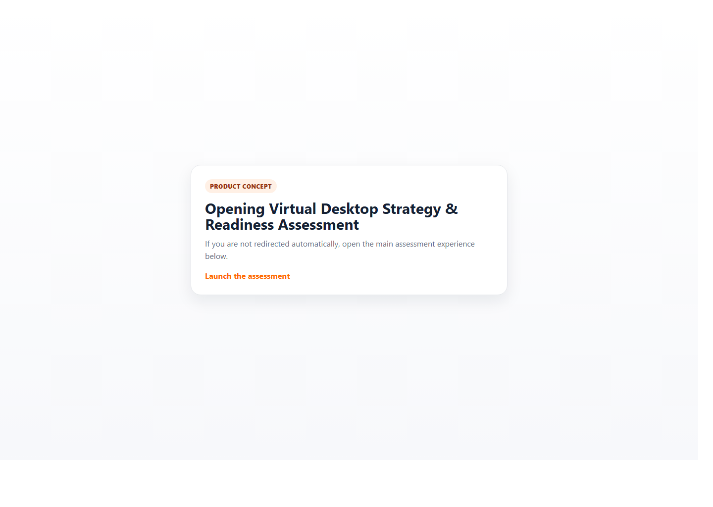
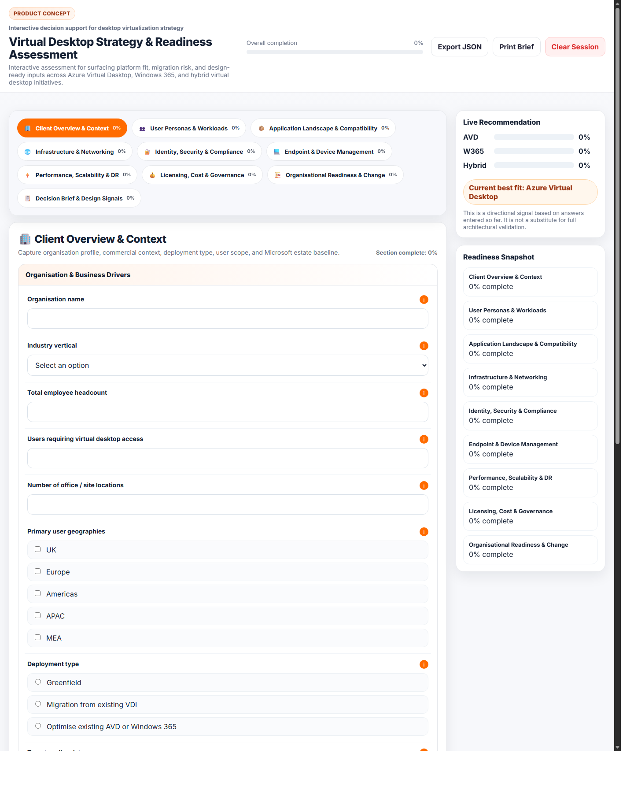

# Virtual Desktop Strategy & Readiness Assessment

Product concept for an interactive desktop virtualization assessment and decision-support experience.

## At a Glance

- Product concept for discovery-led desktop virtualization strategy
- Covers Azure Virtual Desktop, Windows 365, and hybrid scenarios
- Converts workshop inputs into a decision brief with fit signals and readiness indicators
- Ships as a portable static web app that is easy to demo and publish

## Overview

This project reframes the traditional VDI questionnaire as a lightweight product experience. Instead of collecting static inputs in Word or Excel, it guides a discovery conversation, tracks completion in real time, captures design signals, and produces a decision brief across Azure Virtual Desktop, Windows 365, and hybrid scenarios.

The main artifact is [Virtual-Desktop-Strategy-Readiness-Assessment.html](./Virtual-Desktop-Strategy-Readiness-Assessment.html), a self-contained HTML application built for fast sharing, easy iteration, and portfolio presentation.

GitHub Pages entry is [index.html](./index.html), which routes directly into the main assessment.

## Why It Matters

- Converts discovery conversations into structured platform-fit signals
- Surfaces migration risk and readiness gaps before design work begins
- Produces a more product-like and engaging experience than a static intake sheet
- Demonstrates how advisory workflows can be turned into interactive tools

## Feature Highlights

- Multi-tab guided assessment with branching logic
- Live scoring across AVD, Windows 365, and hybrid patterns
- Progress tracking, consultant notes, and readiness indicators
- Visual outputs powered by Chart.js and a geographic view powered by Leaflet
- Single-file delivery model for portability and simple demos

## Preview

### Entry Experience

### Main Assessment Experience

## Experience Snapshot

- Guided discovery flow: structured prompts across business, persona, application, infrastructure, security, endpoint, and readiness domains
- Decision support outputs: directional platform-fit signals, migration complexity indicators, and design-ready summary content
- Shareable delivery model: standalone HTML app plus lightweight Pages entry for simple hosting and demos

## Files

- [index.html](./index.html): lightweight landing page and GitHub Pages entry point
- [Virtual-Desktop-Strategy-Readiness-Assessment.html](./Virtual-Desktop-Strategy-Readiness-Assessment.html): main product concept application

## Positioning

This is a product concept for discovery-led advisory work: part assessment, part decision-support tool, and part design accelerator.
